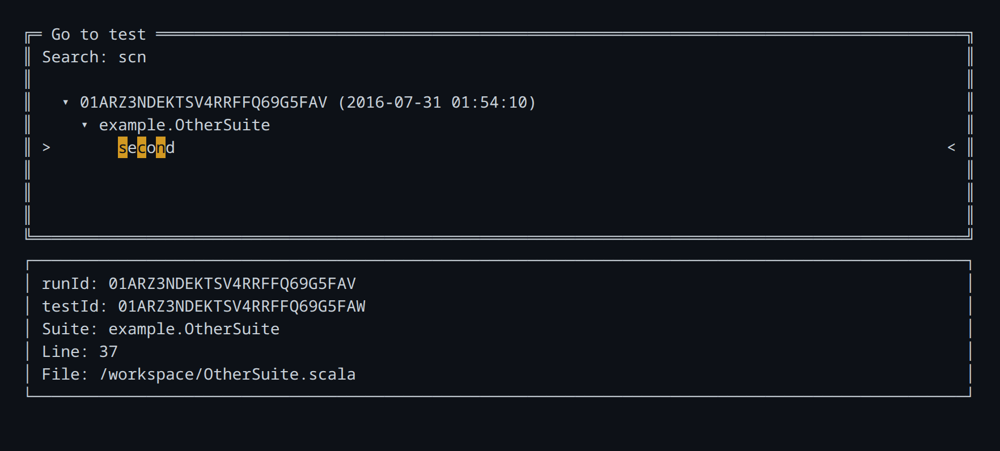
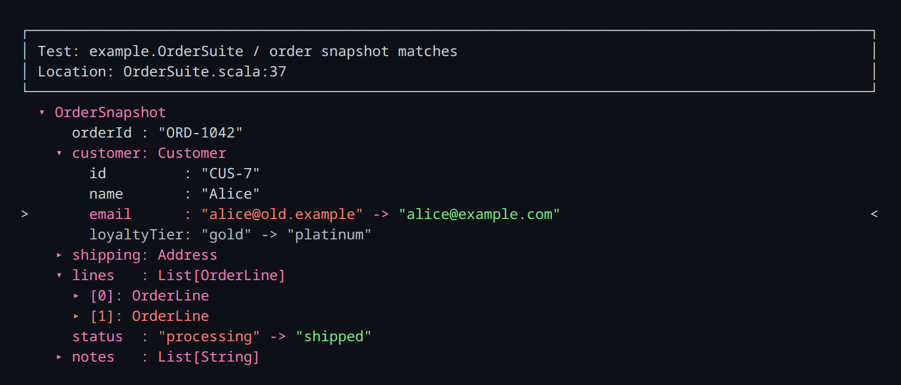

# Diff Viewer UI / CLI

Difflicious CLI provides both interactive and non-interactive viewing of diffs generated
by the tests failures.

You can interactively explore diffs from test failures by launching in TUI (Terminal user interface) mode.
For non-interactive use cases such as for LLM AIs, you can view the diffs in **plain** (human readable) or **JSON** format.

If you are using Difflicious' [`sbt-difflicious` plugin](SbtPlugin.md), 
running `diffliciousViewer` command will launch the TUI / CLI.

## Interactive TUI

By default, the CLI launches in TUI (Terminal User Interface) mode. You can search for tests and interactively explore the differences.

```
sbt> diffliciousViewer
```

<p><b>Search for and select a test failure:</b></p>


<p><b>Explore the selected diff:</b></p>


### Hotkeys

Here are some TUI hotkeys. In general, vim-style keybindings are provided too.

| Hotkey | Action |
| --- | --- |
| <kbd>↑</kbd> / <kbd>k</kbd>, <kbd>↓</kbd> / <kbd>j</kbd> | Move the selection up or down |
| <kbd>Enter</kbd> / <kbd>o</kbd> | Open or toggle the selected entry |
| <kbd>←</kbd> / <kbd>h</kbd>, <kbd>→</kbd> / <kbd>l</kbd> | Collapse or expand the selected field |
| <kbd>f</kbd> / <kbd>b</kbd> | Jump to the next or previous difference |
| <kbd>/</kbd> | Search field names in the current diff |
| <kbd>n</kbd> / <kbd>N</kbd> | Jump to the next or previous search result |
| <kbd>Ctrl</kbd>+<kbd>P</kbd> | Open the test search window |
| <kbd>a</kbd> | Anchor the selected subtree as the root. Useful if you want to "zoom in" on a particular part of the diff) |
| <kbd>t</kbd> | Reset anchoring and return to showing the root of the diff |
| <kbd>?</kbd> / <kbd>F1</kbd> | Show the complete hotkey reference |
| <kbd>Esc</kbd> | Go back or confirm quit |
| <kbd>Ctrl</kbd>+<kbd>C</kbd> / <kbd>Ctrl</kbd>+<kbd>D</kbd> | Quit immediately |

# Non-interactive mode

Non-interactive mode is useful for quickly viewing a diff.

There are two modes:

- Plain (`--plain`): Plain text format useful for both humans and AI agents
- JSON (`--json`): If you need programmatic rendering of the diff details

## Plain text output

To print every recorded test failure as plain text:

```
sbt> diffliciousViewer --plain
```

To print only the failure with a specific test id:

```
sbt> diffliciousViewer --plain --test-id 01ARZ3NDEKTSV4RRFFQ69G5FAW
```

The plain output includes test metadata, a summary, and each difference. For example:

```text
Difflicious diff report: different
Summary: 1 diff failure(s), 6 non-ignored change(s).

Failure 1: example.OrderSuite / order snapshot matches
Run id: 01ARZ3NDEKTSV4RRFFQ69G5FAV
Test id: 01ARZ3NDEKTSV4RRFFQ69G5FAW
Location: /workspace/OrderSuite.scala:37
Difflicious diff result: different
Summary: 6 non-ignored change(s), 1 ignored subtree(s).

Differences:
1. $.customer.email - changed
   obtained: "alice@old.example"
   expected: "alice@example.com"

2. $.customer.loyaltyTier - ignored

3. $.shipping.city - changed
   obtained: "London"
   expected: "Bristol"

4. $.lines[0].quantity - changed
   obtained: 1
   expected: 2

5. $.lines[1] - obtained_only (OrderLine)
   obtained:
      OrderLine(
        sku: "SKU-OLD",
        description: "Discontinued lid",
        quantity: 1,
        unitCents: 499
      )

6. $.status - changed
   obtained: "processing"
   expected: "shipped"

7. $.notes[0] - expected_only
   expected: "Leave with reception"
```
