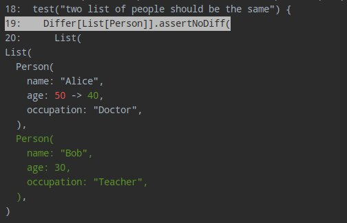

# Quickstart

Let's see how you can use Difflicious in your MUnit tests.

First, add the Difflicious sbt plugin to `project/plugins.sbt`:

```scala
addSbtPlugin("com.github.jatcwang" % "sbt-difflicious" % "@VERSION@")
```

Then add the MUnit integration to `build.sbt`:

```scala
"com.github.jatcwang" %% "difflicious-munit" % "@VERSION@" % Test
```

The plugin configures test report collection and provides tasks such as `diffliciousViewer`. See the
[sbt plugin reference](SbtPlugin.md) for details.

If you are running tests using **IntelliJ IDEA**'s test runner, you should 
turn off the red text coloring it uses for test failure outputs because
it interferes with difflicious' color outputs.

In <b>File | Settings | Editor | Color Scheme | Console Colors | Console | Error Output</b>, uncheck the red foreground color.

Let's say you have some case classes..

```scala mdoc:silent
case class Person(
  name: String,
  age: Int,
  occupation: String
)
```

To perform diffs with Difflicious, you will need to derive some `Differs`

```scala mdoc:silent
import munit.FunSuite
import difflicious.Differ
import difflicious.munit.MUnitDiffliciousSuite

class ExampleTest extends FunSuite with MUnitDiffliciousSuite {

  // Derive Differs for case class and sealed traits 
  implicit val personDiffer: Differ[Person] = Differ.derived[Person]

  test("two list of people should be the same") {
    Differ[List[Person]].assertNoDiff(
      List(
        Person("Alice", 50, "Doctor")
      ),
      List(
        Person("Alice", 40, "Doctor"),
        Person("Bob", 30, "Teacher")
      )
    )
  }
}
```

Run the tests, and you should see a nice failure diff:



Pretty right? You should explore the next sections of the documentation and learn about the different Differs 
and how you can configure them!
